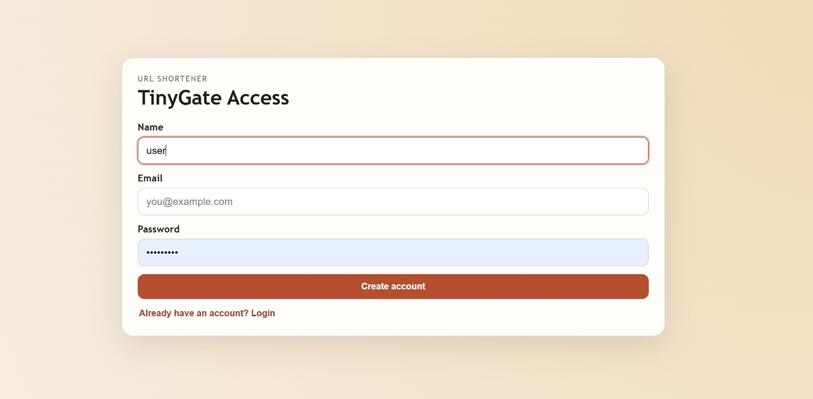
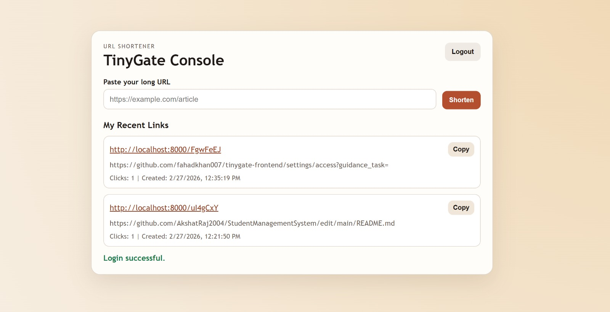
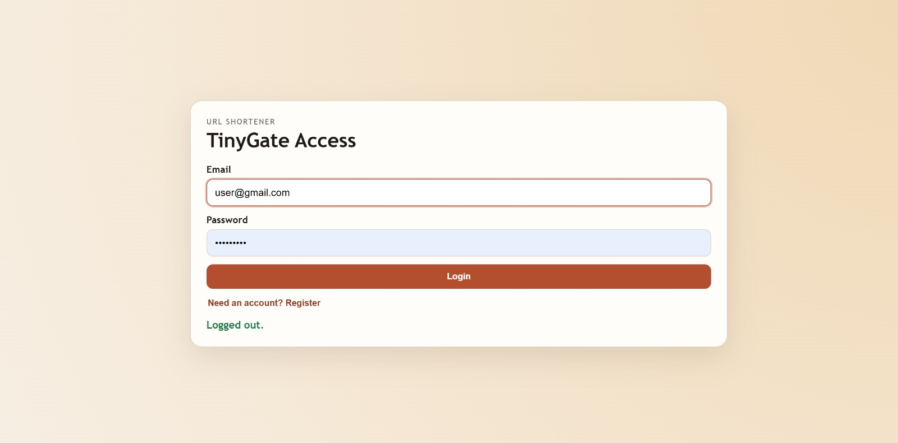

# 🔗 TinyGate – URL Shortener (AWS + Docker Deployment)

## 📌 Project Description

**TinyGate** is a full-stack URL Shortener application that converts long URLs into short, shareable links.

It is built using:

- Backend: Node.js + Express  
- Frontend: ReactJS  
- Database: MongoDB (Atlas)  
- Containerization: Docker  
- Cloud Deployment: AWS (EC2, S3)

---

## 🚀 Features

- 🔗 Generate short URLs instantly  
- 📋 Copy short URL easily  
- 🔁 Redirect to original URL  
- 🗄️ Store URLs in MongoDB  
- 🌍 Cloud deployed architecture  
- 🐳 Docker containerized backend  

---

# 🏗️ Tech Stack

## 🔹 Backend
- Node.js
- Express.js
- MongoDB
- Mongoose
- NanoID / UUID
- dotenv

## 🔹 Frontend
- ReactJS
- Axios
- Bootstrap / TailwindCSS

## 🔹 Database
- MongoDB Atlas (Cloud Database)

## 🔹 DevOps & Cloud
- Docker
- AWS EC2
- AWS S3
- Nginx

---

# 📂 Project Structure

```
tinygate/
│
├── backend/
│   ├── config/
│   │   └── db.js
│   ├── controllers/
│   │   └── urlController.js
│   ├── models/
│   │   └── Url.js
│   ├── routes/
│   │   └── urlRoutes.js
│   ├── server.js
│   ├── .env
│   └── Dockerfile
│
├── frontend/
│   ├── public/
│   ├── src/
│   │   ├── components/
│   │   │   └── UrlForm.js
│   │   ├── services/
│   │   │   └── api.js
│   │   ├── App.js
│   │   └── index.js
│   ├── package.json
│   └── Dockerfile
│
├── docker-compose.yml
└── README.md
```

---

# 🐳 Docker Setup

## 🔹 Backend Dockerfile

```dockerfile
FROM node:18

WORKDIR /app

COPY package*.json ./
RUN npm install

COPY . .

EXPOSE 5000

CMD ["node", "server.js"]
```

---

## 🔹 Frontend Dockerfile (Multi-Stage Build)

```dockerfile
# Stage 1 - Build React App
FROM node:18 as build

WORKDIR /app
COPY . .
RUN npm install
RUN npm run build

# Stage 2 - Serve with Nginx
FROM nginx:alpine
COPY --from=build /app/build /usr/share/nginx/html
```

---

# ⚙️ Environment Variables (.env)

```
PORT=5000
MONGO_URI=your_mongodb_connection_string
BASE_URL=http://your-ec2-public-ip:5000
```

---

# ☁️ AWS Architecture

User → S3 (React Frontend)  
        ↓  
EC2 (Docker Container - Express Backend)  
        ↓  
MongoDB Atlas (Cloud Database)

---

# 🚀 Deployment Steps

## Step 1: Setup MongoDB Atlas

- Create cluster
- Create database
- Whitelist EC2 public IP
- Get connection string
- Update MONGO_URI in .env

---

## Step 2: Deploy Backend to EC2

1. Launch Ubuntu EC2 instance  
2. Install Docker  
3. Clone repository  
4. Build Docker image  

```
docker build -t tinygate-backend .
docker run -d -p 5000:5000 tinygate-backend
```

---

## Step 3: Deploy Frontend to S3

1. Run:

```
npm run build
```

2. Upload `build/` folder to S3 bucket  
3. Enable Static Website Hosting  
4. Make bucket public  

---

# 🔐 Security Considerations

- Store secrets in environment variables  
- Restrict EC2 security group inbound rules  
- Enable HTTPS using SSL certificate  
- Avoid exposing MongoDB publicly  

---

# 📈 Future Enhancements

- Add authentication (JWT)
- Add analytics (click tracking)
- Add rate limiting
- Implement CI/CD pipeline
- Use Load Balancer + Auto Scaling

---

# 🎯 Key DevOps Concepts Used

- Containerization (Docker)
- Multi-stage builds
- Port mapping
- Cloud deployment
- Security groups
- Static website hosting
- Managed database service

---
# 📸 Application Screenshots

## 🔹 Home Page


## 🔹 Short URL Generated


## 🔹 Redirect Working


---
# 👨‍💻 Author

Developed as a Full-Stack + DevOps learning project.
